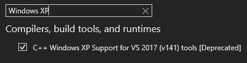

# **[Deprecation Notice]**

This project is now deprecated, and while you can still use it (and for new modders, or modders using AutPI, it may be recommended as it adds some useful features) it will only be updated to have bug fixes in the future if absolutely neccessary. Or moving features to separate dlls, if I really feel like it. Or outright removing features and putting them as lua script examples in the autpi repo. Nothing will be added though, more than likely.

__Ensure you use the GitHub issues system, or pull requests if you have bug fixes for Autumns Various Additions__.

# Cave Story Mod Loader ~ Autumn's Various Additions
This is a mod that adds many features to Cave Story freeware, made with help from multiple people. It can be compiled using Visual Studio 2022 for making dll mods for Cave Story freeware, using [Clownacy's Mod Loader](https://github.com/Clownacy/Cave-Story-Mod-Loader/releases).

You'll first need a copy of [Visual Studio 2022](https://visualstudio.microsoft.com/downloads/). When you're installing it, go to the individual components tab and select the "C++ Windows XP Support for VS 2017 (v141) tools [Deprecated]".

If you already have Visual Studio 2022, search your computer for "Visual Studio Installer", and click modify on Visual Studio 2022. Go to the invididual components tab, and select the "C++ Windows XP Support for VS 2017 (v141) tools [Deprecated]" like shown above.

After that's all installed, you should be able to just compile the dll using the mod.sln file, and test it just by opening the game.

Note that anyone who plays mods using your dll should install the latest [vc_redist](https://aka.ms/vs/17/release/vc_redist.x86.exe) for x86 if they do not have it. It has to be x86, even if your computer is x64.

### Credits

Brayconn - .cpxe file loading in editor and game

Periwinkle - Many code changes and patches

Quotation - Custom npcs / walljumping / double jump code

Bionicobot - Original <BKG code used
